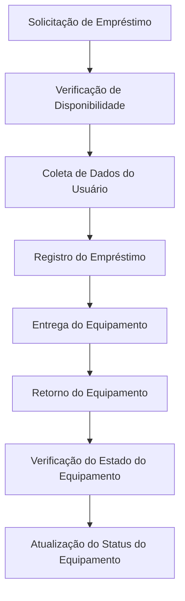
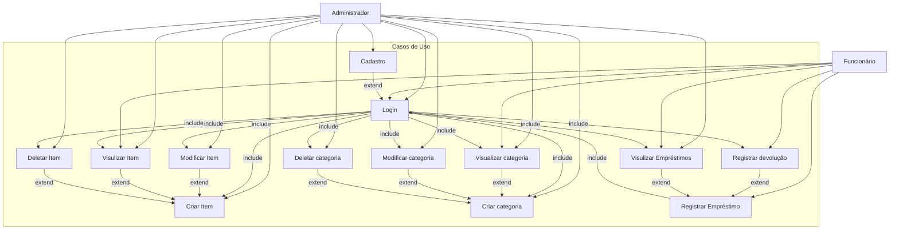
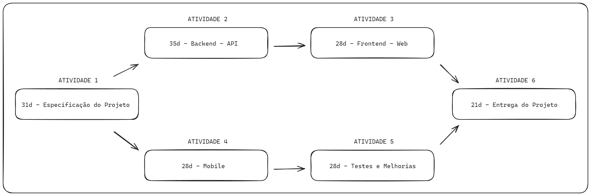
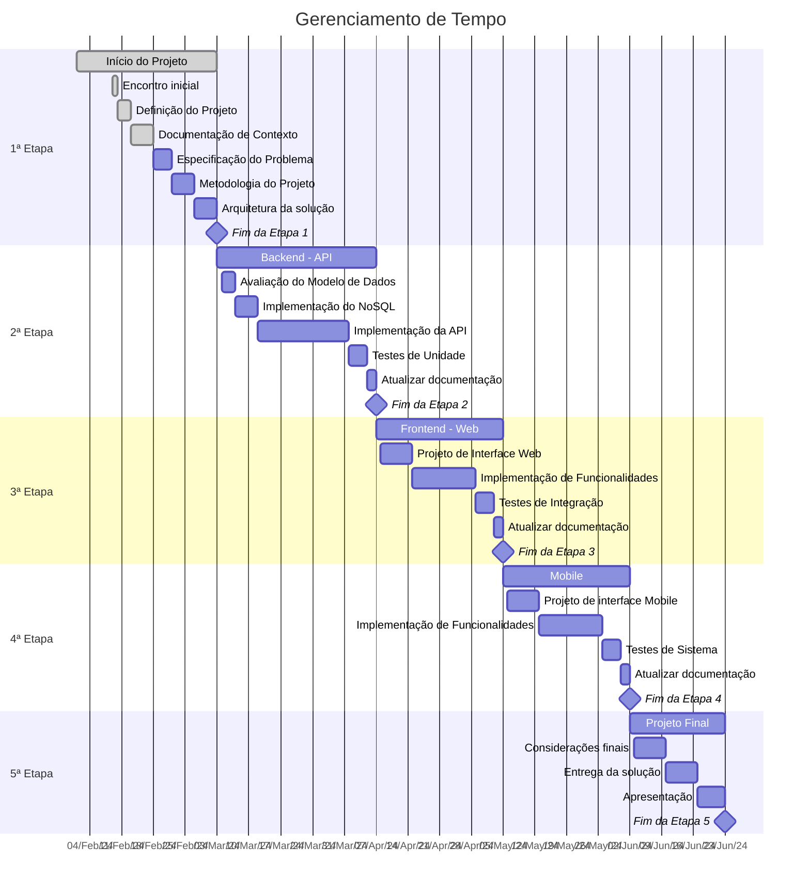
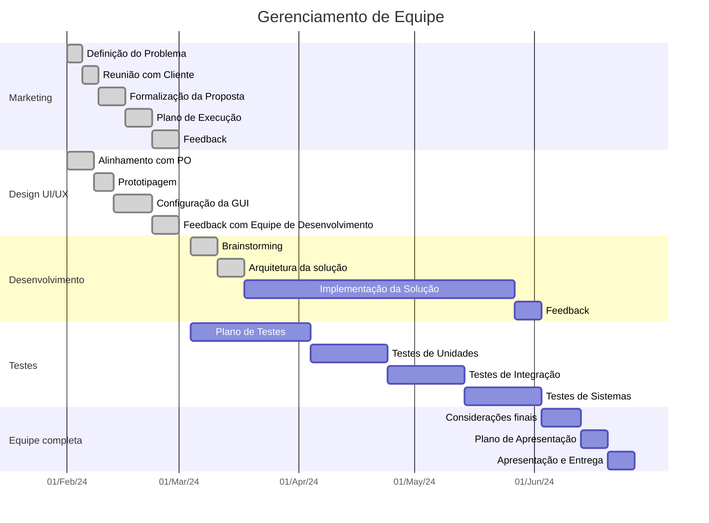

# Especificações do Projeto

A ideia do projeto é um sistema de empréstimo de itens. Vamos imaginar o cenário em que você precisa de um item por um determinado período, uma mesa digitalizadora, uma WebCam ou até mesmo um fone, por exemplo. Você irá fazer o pedido do item pessoalmente e o funcionário irá coletar seu dados e registrar no sistema conjunto com o empréstimo do item.

No caso o sistema será utilizado para o controle e segurança dos itens, sendo assim somente funcionários terão acesso.

## Personas

As pessoas retratadas durante o processo de compreensão do problema são apresentadas nas figuras que seguem.

 

### Pedro Paulo
**Idade:** 26 anos 
**Ocupação:** Funcionário 
**Hobbies:** Técnico 
**Frustrações:** O programa lento é muito confuso e pouco intuitivo. 
**Motivação:** Facilitar o uso e diminuir a lentidão do aplicativo. 

---

 

### Marcia
**Idade:** 27 anos 
**Ocupação:** Auxilar de TI 
**Hobbies:** Cuidar de planta 
**Frustrações:** Não ter acesso a um sistema mobile que possa ser utilizado para fazer trocas 
**Motivação:** O sistema fica associado apenas à um computador e usuário, dificultando o uso. Um sistema distribuido e mobile ajudaria.. 

---

 

### Paula Maria
**Idade:** 24 anos 
**Ocupação:** Lider Técnico  
**Hobbies:** Robótica 
**Frustrações:** Tive muita dificuldade quando entrei na empresa para aprender como funcionava o sistema.  
**Motivação:** Ter um sistema mais leve e fácil manipulação. 

---

### Marcos
**Idade:** 24 anos 
**Ocupação:** Funcionário 
**Hobbies:** Plantação 
**Frustrações:** O sistema legado roda somente em um computador, pois o mesmo usa um banco de dados local, se este único computador der problema... putz. 
**Motivação:** Permitir que o sistema rode em uma versão web para que todos possamos acessar em vários computadores. 

---

## Histórias de Usuários

Com base na análise das personas forma identificadas as seguintes histórias de usuários:

|EU COMO... `PERSONA`| QUERO/PRECISO ... `FUNCIONALIDADE` |PARA ... `MOTIVO/VALOR`                 |
|--------------------|------------------------------------|----------------------------------------|
|Pedro Paulo  | Um sistema mais intuitivo.          | Fazer o empréstimo rapidamente para o meu conforto e do cliente. |
|Marcos       | Um sistema distribuído.             | Poder acessar o sistema facilmente. |
|Paula Maria  | Facilitar o dia a dia do funcionário.  | Não precisar ficar quebrando a cabeça com as funcionalidades do sistema. |
|Marcia       | Sistema Mobile. | Um sistema de facil acesso e manipulação. |

## Modelagem do Processo de Negócio 

### Análise da Situação Atual

Apresente aqui os problemas existentes que viabilizam sua proposta. Apresente o modelo do sistema como ele funciona hoje. Caso sua proposta seja inovadora e não existam processos claramente definidos, apresente como as tarefas que o seu sistema pretende implementar são executadas atualmente, mesmo que não se utilize tecnologia computacional. 

### Descrição Geral da Proposta

A proposta é uma aplicação distribuida web e mobile de empréstimo de equipamentos de informártica, para uso de alunos dos cursos de técnologia da informação e funcionários técnicos do setor. A aplicação deverá armazenar o inventário dos equipamentos, ver a disponibilidade dos equipamentos, ter a função de empréstimo e devolução e autenticação de usuário no momento do empréstimo e devolução.

### Processo 1 – Empréstimo ao Usuário

## Indicadores de Desempenho

Apresente aqui os principais indicadores de desempenho e algumas metas para o processo. Atenção: as informações necessárias para gerar os indicadores devem estar contempladas no diagrama de classe. Colocar no mínimo 5 indicadores. 

Usar o seguinte modelo: 

Obs.: todas as informações para gerar os indicadores devem estar no diagrama de classe a ser apresentado a posteriori. 

## Requisitos

As tabelas que se seguem apresentam os requisitos funcionais e não funcionais que detalham o escopo do projeto. Para determinar a prioridade de requisitos, aplicar uma técnica de priorização de requisitos e detalhar como a técnica foi aplicada.

### Requisitos Funcionais

| ID     | Descrição do Requisito   | Prioridade |
| ------ | ----------------------------------------- | ---- |
| RF-001 | A aplicação deve ser distribuída, permitindo o acesso em vários computadores conectados à rede | ALTA | 
| RF-002 | A aplicação deve permitir o empréstimo de equipamentos de informática   | ALTA |
| RF-003 | A aplicação deve ser acessada apenas com administrador | MÉDIA | 
| RF-004 | O empréstimo deve ser validado com a identidade acadêmica do aluno ou professor    | MÉDIA |
| RF-005 | A devolução deve ser validada com a identificação do acadêmico do aluno ou professor | MÉDIA | 
| RF-006 | A aplicação deve permitir o cadastro de novos itens    | ALTA |
| RF-007 | A aplicação deve permitir a edição de itens | ALTA | 
| RF-008 | A aplicação deve permitir a exclusão de itens   | ALTA |
| RF-009 | A aplicação deve apresentar qual o código do usuário tomador | MÉDIA | 
| RF-010 | A aplicação deve apresentar em qual local foi colocado o equipamento    | MÉDIA |

### Requisitos não Funcionais

| ID      | Descrição do Requisito   | Prioridade |
| ------- | ------------------------- | ---- |
| RNF-001 | O sistema deve ser responsivo para rodar em dispositivos móveis | MÉDIA | 
| RNF-002 | Deve processar requisições do usuário em no máximo 3s |   BAIXA | 
| RNF-003 | A aplicação deve ser intuitiva |  BAIXA | 

## Restrições

O projeto está restrito pelos itens apresentados na tabela a seguir.

|ID| Restrição                                             |
|--|-------------------------------------------------------|
|01| O projeto deverá ser entregue até o final do semestre |
|02| Não pode ser desenvolvido um módulo de backend        |

## Diagrama de Casos de Uso

# Matriz de Rastreabilidade

| Requisito Funcional | Registrar Empréstimo | Registrar Devolução | CRUD Item | CRUD Usuário |
|----------------------|----------------------|----------------------|-----------|--------------|
| RF-001               |                      |                      |           |              |
| RF-002               |          X           |                      |           |              |
| RF-003               |                      |                      |           |              |
| RF-004               |          X           |                      |           |              |
| RF-005               |                      |          X           |           |              |
| RF-006               |                      |                      |     X     |              |
| RF-007               |                      |                      |     X     |              |
| RF-008               |                      |                      |     X     |              |
| RF-009               |                      |                      |           |              |
| RF-010               |                      |                      |           |              |

# Gerenciamento de Projeto

De acordo com o PMBoK v6 as dez áreas que constituem os pilares para gerenciar projetos, e que caracterizam a multidisciplinaridade envolvida, são: Integração, Escopo, Cronograma (Tempo), Custos, Qualidade, Recursos, Comunicações, Riscos, Aquisições, Partes Interessadas. Para desenvolver projetos um profissional deve se preocupar em gerenciar todas essas dez áreas. Elas se complementam e se relacionam, de tal forma que não se deve apenas examinar uma área de forma estanque. É preciso considerar, por exemplo, que as áreas de Escopo, Cronograma e Custos estão muito relacionadas. Assim, se eu amplio o escopo de um projeto eu posso afetar seu cronograma e seus custos.

## Gerenciamento de Tempo

Com diagramas bem organizados que permitem gerenciar o tempo nos projetos, o gerente de projetos agenda e coordena tarefas dentro de um projeto para estimar o tempo necessário de conclusão. A ferramenta utilizada para criação do diagrama foi o [Excalidraw](https://excalidraw.com/).

O gráfico de Gantt ou diagrama de Gantt também é uma ferramenta visual utilizada para controlar e gerenciar o cronograma de atividades de um projeto. Com ele, é possível listar tudo que precisa ser feito para colocar o projeto em prática, dividir em atividades e estimar o tempo necessário para executá-las. Neste projeto, foi utilizada a ferramenta `mermaid.js` para criar o diagrama. Segue a [documentação](https://mermaid.js.org/syntax/gantt.html) da ferramenta para consulta.

## Gerenciamento de Equipe

O gerenciamento adequado de tarefas contribuirá para que o projeto alcance altos níveis de produtividade. Por isso, é fundamental que ocorra a gestão de tarefas e de pessoas, de modo que os times envolvidos no projeto possam ser facilmente gerenciados. Assim como na seção de Gerenciamento de Tempo, também foi utilizada a ferramenta `mermaid.js` para representar o Gerenciamento de Equipe.

## Gestão de Orçamento

O processo de determinar o orçamento do projeto é uma tarefa que depende, além dos produtos (saídas) dos processos anteriores do gerenciamento de custos, também de produtos oferecidos por outros processos de gerenciamento, como o escopo e o tempo.

|Recursos Necessários | Custo estimado (R$)                |
|--|-------------------------------------------------------|
| Hardware |  R$60.000 |
| Marketing |  R$25.000 |
| Recursos Humanos | R$180.000 |
| Rede |  R$15.000 |
| Software |  R$20.000 |
| Serviços em Nuvem |  R$15.000 |
| **TOTAL** |  R$315.000 |
