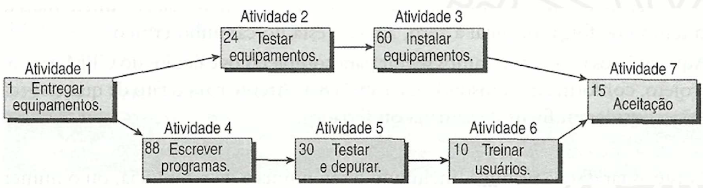

# Especificações do Projeto

A ideia do projeto é um sistema de empréstimo de itens. Vamos imaginar o cenário que você precisa de um item por um determinado período, uma mesa digitalizadora, uma WebCam ou ate mesmo um fone, por exemplo. Você ira fazer o pedido do item pessoalmente e o funcionario ira coletar seu dados e registrar no sistema conjunto com o emprestimo do item.

No caso o sistema será utilizado para o controle e segurança dos itens, sendo assim somente funcionarios terão acesso.

## Personas

As pessoas retratadas durante o processo de compreensão do problema são apresentadas nas figuras que seguem.

### Pedro Paulo
**Idade:** 26 anos 
**Ocupação:** Funcionario 
**Hobbies:** Programar 
**Frustrações:** O programa legado é muito confuso e pouco intuitivo. 
**Motivação:** Facilitar o uso do mesmo no dia a dia. 

---

### Paula Maria
**Idade:** 24 anos 
**Ocupação:** Funcionario  
**Hobbies:** Robótica 
**Frustrações:** Tive muita dificuldade quando entrei na empresa para aprender como funcionava o sistema.  
**Motivação:** Ter um sistema mais leve e fácil manipulação. 

---

### Marcos
**Idade:** 24 anos 
**Ocupação:** Funcionario 
**Hobbies:** Plantação 
**Frustrações:** O sistema legado roda somente em um computador pois o mesmo usa um banco de dados local, se este unico computador der problema.. putz. 
**Motivação:** Permitir que o sistema rode em uma versão web para que todos possamos acessar em varios computadores. 

---

## Histórias de Usuários

Com base na análise das personas forma identificadas as seguintes histórias de usuários:

|EU COMO... `PERSONA`| QUERO/PRECISO ... `FUNCIONALIDADE` |PARA ... `MOTIVO/VALOR`                 |
|--------------------|------------------------------------|----------------------------------------|
|Pedro Paulo  | Um sistema mais intuitivo.          | Fazer o emprestimo rapidamente para o conforto meu e do aluno. |
|Marcos       | Um sistema distribuido.             | Poder acessar o sistema fácilmente. |
|Paula Maria  | Facilitar o dia a dia do funcionario.  | Não precisar ficar quebrando a cabeça com a funcionalidades do sistema. |

## Modelagem do Processo de Negócio 

### Análise da Situação Atual

Apresente aqui os problemas existentes que viabilizam sua proposta. Apresente o modelo do sistema como ele funciona hoje. Caso sua proposta seja inovadora e não existam processos claramente definidos, apresente como as tarefas que o seu sistema pretende implementar são executadas atualmente, mesmo que não se utilize tecnologia computacional. 

### Descrição Geral da Proposta

Apresente aqui uma descrição da sua proposta abordando seus limites e suas ligações com as estratégias e objetivos do negócio. Apresente aqui as oportunidades de melhorias.

### Processo 1 – NOME DO PROCESSO

Apresente aqui o nome e as oportunidades de melhorias para o processo 1. Em seguida, apresente o modelo do processo 1, descrito no padrão BPMN. 

### Processo 2 – NOME DO PROCESSO

Apresente aqui o nome e as oportunidades de melhorias para o processo 2. Em seguida, apresente o modelo do processo 2, descrito no padrão BPMN.

## Indicadores de Desempenho

Apresente aqui os principais indicadores de desempenho e algumas metas para o processo. Atenção: as informações necessárias para gerar os indicadores devem estar contempladas no diagrama de classe. Colocar no mínimo 5 indicadores. 

Usar o seguinte modelo: 

Obs.: todas as informações para gerar os indicadores devem estar no diagrama de classe a ser apresentado a posteriori. 

## Requisitos

As tabelas que se seguem apresentam os requisitos funcionais e não funcionais que detalham o escopo do projeto. Para determinar a prioridade de requisitos, aplicar uma técnica de priorização de requisitos e detalhar como a técnica foi aplicada.

### Requisitos Funcionais

| ID     | Descrição do Requisito   | Prioridade |
| ------ | ----------------------------------------- | ---- |
| RF-001 | A aplicação deve ser distribuída, permitindo o acesso em vários computadores conectados à rede | ALTA | 
| RF-002 | A aplicação deve permitir o empréstimo de equipamentos de informática   | ALTA |
| RF-003 | A aplicação deve ser acessada apenas com administrador | MÍDIA | 
| RF-004 | O empréstimo deve ser validado com a identidade acadêmica do aluno ou professor    | MÍDIA |
| RF-005 | A devolução deve ser validada com a identificação do acadêmico do aluno ou professor | MÍDIA | 
| RF-006 | A aplicação deve permitir o cadastro de novos itens    | ALTA |
| RF-007 | A aplicação deve permitir a edição de itens | ALTA | 
| RF-008 | A aplicação deve permitir a exclusão de itens   | ALTA |
| RF-009 | A aplicação deve apresentar qual o código do usuário tomador | MÍDIA | 
| RF-010 | A aplicação deve apresentar em qual local foi colocado o equipamento    | MÍDIA |

### Requisitos não Funcionais

| ID      | Descrição do Requisito   | Prioridade |
| ------- | ------------------------- | ---- |
| RNF-001 | O sistema deve ser responsivo para rodar em dispositivos móveis | MÍDIA | 
| RNF-002 | Deve processar requisições do usuário em no máximo 3s |   BAIXA | 
| RNF-003 | A aplicação deve ser intuitiva |   BAIXA | 

## Restrições

O projeto está restrito pelos itens apresentados na tabela a seguir.

|ID| Restrição                                             |
|--|-------------------------------------------------------|
|01| O projeto deverá ser entregue até o final do semestre |
|02| Não pode ser desenvolvido um módulo de backend        |

## Diagrama de Casos de Uso

O diagrama de casos de uso é o próximo passo após a elicitação de requisitos, que utiliza um modelo gráfico e uma tabela com as descrições sucintas dos casos de uso e dos atores. Ele contempla a fronteira do sistema e o detalhamento dos requisitos funcionais com a indicação dos atores, casos de uso e seus relacionamentos. 

As referências abaixo irão auxiliá-lo na geração do artefato “Diagrama de Casos de Uso”.

> **Links Úteis**:
> - [Criando Casos de Uso](https://www.ibm.com/docs/pt-br/elm/6.0?topic=requirements-creating-use-cases)
> - [Como Criar Diagrama de Caso de Uso: Tutorial Passo a Passo](https://gitmind.com/pt/fazer-diagrama-de-caso-uso.html/)
> - [Lucidchart](https://www.lucidchart.com/)
> - [Astah](https://astah.net/)
> - [Diagrams](https://app.diagrams.net/)

# Matriz de Rastreabilidade

A matriz de rastreabilidade é uma ferramenta usada para facilitar a visualização dos relacionamento entre requisitos e outros artefatos ou objetos, permitindo a rastreabilidade entre os requisitos e os objetivos de negócio. 

A matriz deve contemplar todos os elementos relevantes que fazem parte do sistema, conforme a figura meramente ilustrativa apresentada a seguir.

> **Links Úteis**:
> - [Artigo Engenharia de Software 13 - Rastreabilidade](https://www.devmedia.com.br/artigo-engenharia-de-software-13-rastreabilidade/12822/)
> - [Verificação da rastreabilidade de requisitos usando a integração do IBM Rational RequisitePro e do IBM ClearQuest Test Manager](https://developer.ibm.com/br/tutorials/requirementstraceabilityverificationusingrrpandcctm/)
> - [IBM Engineering Lifecycle Optimization – Publishing](https://www.ibm.com/br-pt/products/engineering-lifecycle-optimization/publishing/)

# Gerenciamento de Projeto

De acordo com o PMBoK v6 as dez áreas que constituem os pilares para gerenciar projetos, e que caracterizam a multidisciplinaridade envolvida, são: Integração, Escopo, Cronograma (Tempo), Custos, Qualidade, Recursos, Comunicações, Riscos, Aquisições, Partes Interessadas. Para desenvolver projetos um profissional deve se preocupar em gerenciar todas essas dez áreas. Elas se complementam e se relacionam, de tal forma que não se deve apenas examinar uma área de forma estanque. É preciso considerar, por exemplo, que as áreas de Escopo, Cronograma e Custos estão muito relacionadas. Assim, se eu amplio o escopo de um projeto eu posso afetar seu cronograma e seus custos.

## Gerenciamento de Tempo

Com diagramas bem organizados que permitem gerenciar o tempo nos projetos, o gerente de projetos agenda e coordena tarefas dentro de um projeto para estimar o tempo necessário de conclusão.

O gráfico de Gantt ou diagrama de Gantt também é uma ferramenta visual utilizada para controlar e gerenciar o cronograma de atividades de um projeto. Com ele, é possível listar tudo que precisa ser feito para colocar o projeto em prática, dividir em atividades e estimar o tempo necessário para executá-las.

## Gerenciamento de Equipe

O gerenciamento adequado de tarefas contribuirá para que o projeto alcance altos níveis de produtividade. Por isso, é fundamental que ocorra a gestão de tarefas e de pessoas, de modo que os times envolvidos no projeto possam ser facilmente gerenciados. 

## Gestão de Orçamento

O processo de determinar o orçamento do projeto é uma tarefa que depende, além dos produtos (saídas) dos processos anteriores do gerenciamento de custos, também de produtos oferecidos por outros processos de gerenciamento, como o escopo e o tempo.

