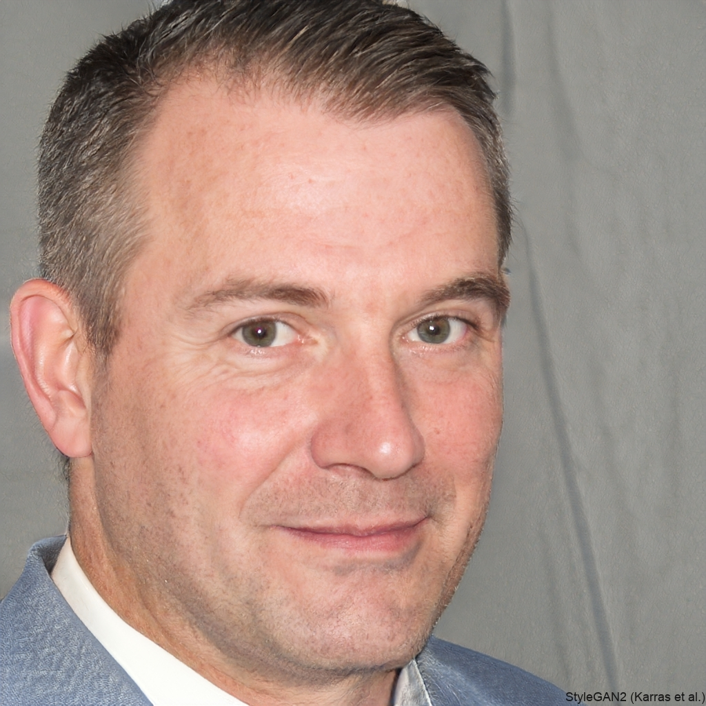

# Especificações do Projeto

A ideia do projeto é um sistema de empréstimo de itens. Vamos imaginar o cenário que você precisa de um item específico por um determinado período, em caso de uma obra em casa, por exemplo. Em vez de ter de comprar este item e nunca mais o utilizar, ou em vez de pagar um preço alto e passar por um processo burocrático chato fazendo o aluguel com alguma empresa, o nossos sistema oferece um processo ágil com o mínimo de burocracia possívevl.

Os itens disponibilizados para empréstimo estão divididos em categoria. Os usuários só poderão utilizar o sistema após autenticação com sucesso.

## Personas

As pessoas retratadas durante o processo de compreensão do problema são apresentadas nas figuras que seguem.

### Pedro Paulo
**Idade:** 26 anos 
**Ocupação:** Arquiteto 
**Hobbies:** Marcenaria 
**Frustrações:** Apesar do seu hobbie, Pedro mora em um apartamento pequeno e não consegue ter e armazenar todas as ferramentas que precisa para seu hobbie. 
**Motivação:** Facilitar o acesso a ferramentas de marcenaria em um espaço limitado, utilizando-as quando precisar sem a necessidade de as guardar em seu apartamento. 

---

### Paula Maria
**Idade:** 24 anos 
**Ocupação:** Professora  
**Hobbies:** Pintura 
**Frustrações:** Os materiais para pintura costumam ser caros e, por vezes, deixa de fazer algo pro falta de material necessário. 
**Motivação:** Possibilitar a realização de projetos artísticos ao oferecer acesso a materiais de pintura de forma econômica e acessível. 

---

### Marcos
**Idade:** 24 anos 
**Ocupação:** Engenheiro 
**Hobbies:** Plantação 
**Frustrações:** Por ter começado recentemente a mexer com plantas e animais, Marcos não dispõe do dinheiro ou espaço para ter os equipamentos necessários. 
**Motivação:** Permitir-se desenvolver seu hobby de plantação ao conseguir acesso a equipamentos e ferramentas essenciais, superando as limitações financeiras e de espaço. 

---

### Clara Silva
**Idade:** 30 anos 
**Ocupação:** Engenheira de Computação 
**Hobbies:** Jardinagem 
**Frustrações:** Clara ama cuidar de plantas, mas mora em um apartamento sem espaço externo para ter um jardim próprio. Ela gostaria de ter acesso a ferramentas de jardinagem e vasos de plantas de forma temporária, sem precisar investir em itens que ocupariam espaço em sua casa. 
**Motivação:** Facilitar sua paixão pela jardinagem ao ter acesso temporário a ferramentas e vasos de plantas, permitindo-lhe cultivar um jardim em seu apartamento sem custos significativos de espaço ou financeiros. 

---

### Rafael Oliveira
**Idade:** 42 anos 
**Ocupação:** Contador 
**Hobbies:** Fotografia 
**Frustrações:** Rafael ama fotografar, mas precisa de equipamentos específicos para determinados projetos, como lentes especiais ou tripés mais robustos, que são caros. Ele gostaria de acessar esses equipamentos temporariamente, sem ter que gastar uma grande quantia de dinheiro em algo que só usará ocasionalmente. 
**Motivação:** Explorar sua paixão pela fotografia, tendo acesso temporário a equipamentos específicos essenciais, permitindo-se concretizar suas visões criativas sem a necessidade de adquirir equipamentos. 

---

## Histórias de Usuários

Com base na análise das personas forma identificadas as seguintes histórias de usuários:

|EU COMO... `PERSONA`| QUERO/PRECISO ... `FUNCIONALIDADE` |PARA ... `MOTIVO/VALOR`                 |
|--------------------|------------------------------------|----------------------------------------|
|Pedro Paulo  |Procurar ferramentas de marcenaria          | Concluir meus projetos pessoais de marcenaria               |
|Marcos       | Pegar emprestador um trator                 | Iniciar plantio em grande escala |
|Paula Maria       | Um cavalete grande suficiente para uma tela 80 x 100                | Começar a trabalhar com telas maiores |
|Clara Silva       | Ferramentas de jardinagem e plantio                | Cultivar meu jardim em meu apartamento sem gastar muito dinheiro e ter que guardar ferramentas|
|Rafael Oliveira       | Lente de 80mm e tripé profissional                | Capturar imagens de alta qualidade e alcançar resultados profissionais |

## Modelagem do Processo de Negócio 

### Análise da Situação Atual

Apresente aqui os problemas existentes que viabilizam sua proposta. Apresente o modelo do sistema como ele funciona hoje. Caso sua proposta seja inovadora e não existam processos claramente definidos, apresente como as tarefas que o seu sistema pretende implementar são executadas atualmente, mesmo que não se utilize tecnologia computacional. 

### Descrição Geral da Proposta

Apresente aqui uma descrição da sua proposta abordando seus limites e suas ligações com as estratégias e objetivos do negócio. Apresente aqui as oportunidades de melhorias.

### Processo 1 – NOME DO PROCESSO

Apresente aqui o nome e as oportunidades de melhorias para o processo 1. Em seguida, apresente o modelo do processo 1, descrito no padrão BPMN. 

### Processo 2 – NOME DO PROCESSO

Apresente aqui o nome e as oportunidades de melhorias para o processo 2. Em seguida, apresente o modelo do processo 2, descrito no padrão BPMN.

## Indicadores de Desempenho

Apresente aqui os principais indicadores de desempenho e algumas metas para o processo. Atenção: as informações necessárias para gerar os indicadores devem estar contempladas no diagrama de classe. Colocar no mínimo 5 indicadores. 

Usar o seguinte modelo: 

Obs.: todas as informações para gerar os indicadores devem estar no diagrama de classe a ser apresentado a posteriori. 

## Requisitos

As tabelas que se seguem apresentam os requisitos funcionais e não funcionais que detalham o escopo do projeto. Para determinar a prioridade de requisitos, aplicar uma técnica de priorização de requisitos e detalhar como a técnica foi aplicada.

### Requisitos Funcionais

| ID     | Descrição do Requisito   | Prioridade |
| ------ | ----------------------------------------- | ---- |
| RF-001 | A aplicação deve ser distribuída, permitindo o acesso em vários computadores conectados à rede | ALTA | 
| RF-002 | A aplicação deve permitir o empréstimo de equipamentos de informática   | ALTA |
| RF-003 | A aplicação deve ser acessada apenas com administrador | MÍDIA | 
| RF-004 | O empréstimo deve ser validado com a identidade acadêmica do aluno ou professor    | MÍDIA |
| RF-005 | A devolução deve ser validada com a identificação do acadêmico do aluno ou professor | MÍDIA | 
| RF-006 | A aplicação deve permitir o cadastro de novos itens    | ALTA |
| RF-007 | A aplicação deve permitir a edição de itens | ALTA | 
| RF-008 | A aplicação deve permitir a exclusão de itens   | ALTA |
| RF-009 | A aplicação deve apresentar qual o código do usuário tomador | MÍDIA | 
| RF-010 | A aplicação deve apresentar em qual local foi colocado o equipamento    | MÍDIA |

### Requisitos não Funcionais

| ID      | Descrição do Requisito   | Prioridade |
| ------- | ------------------------- | ---- |
| RNF-001 | O sistema deve ser responsivo para rodar em dispositivos móveis | MÍDIA | 
| RNF-002 | Deve processar requisições do usuário em no máximo 3s |   BAIXA | 
| RNF-003 | A aplicação deve ser intuitiva |   BAIXA | 

## Restrições

O projeto está restrito pelos itens apresentados na tabela a seguir.

|ID| Restrição                                             |
|--|-------------------------------------------------------|
|01| O projeto deverá ser entregue até o final do semestre |
|02| Não pode ser desenvolvido um módulo de backend        |

## Diagrama de Casos de Uso

O diagrama de casos de uso é o próximo passo após a elicitação de requisitos, que utiliza um modelo gráfico e uma tabela com as descrições sucintas dos casos de uso e dos atores. Ele contempla a fronteira do sistema e o detalhamento dos requisitos funcionais com a indicação dos atores, casos de uso e seus relacionamentos. 

As referências abaixo irão auxiliá-lo na geração do artefato “Diagrama de Casos de Uso”.

> **Links Úteis**:
> - [Criando Casos de Uso](https://www.ibm.com/docs/pt-br/elm/6.0?topic=requirements-creating-use-cases)
> - [Como Criar Diagrama de Caso de Uso: Tutorial Passo a Passo](https://gitmind.com/pt/fazer-diagrama-de-caso-uso.html/)
> - [Lucidchart](https://www.lucidchart.com/)
> - [Astah](https://astah.net/)
> - [Diagrams](https://app.diagrams.net/)

# Matriz de Rastreabilidade

A matriz de rastreabilidade é uma ferramenta usada para facilitar a visualização dos relacionamento entre requisitos e outros artefatos ou objetos, permitindo a rastreabilidade entre os requisitos e os objetivos de negócio. 

A matriz deve contemplar todos os elementos relevantes que fazem parte do sistema, conforme a figura meramente ilustrativa apresentada a seguir.

> **Links Úteis**:
> - [Artigo Engenharia de Software 13 - Rastreabilidade](https://www.devmedia.com.br/artigo-engenharia-de-software-13-rastreabilidade/12822/)
> - [Verificação da rastreabilidade de requisitos usando a integração do IBM Rational RequisitePro e do IBM ClearQuest Test Manager](https://developer.ibm.com/br/tutorials/requirementstraceabilityverificationusingrrpandcctm/)
> - [IBM Engineering Lifecycle Optimization – Publishing](https://www.ibm.com/br-pt/products/engineering-lifecycle-optimization/publishing/)

# Gerenciamento de Projeto

De acordo com o PMBoK v6 as dez áreas que constituem os pilares para gerenciar projetos, e que caracterizam a multidisciplinaridade envolvida, são: Integração, Escopo, Cronograma (Tempo), Custos, Qualidade, Recursos, Comunicações, Riscos, Aquisições, Partes Interessadas. Para desenvolver projetos um profissional deve se preocupar em gerenciar todas essas dez áreas. Elas se complementam e se relacionam, de tal forma que não se deve apenas examinar uma área de forma estanque. É preciso considerar, por exemplo, que as áreas de Escopo, Cronograma e Custos estão muito relacionadas. Assim, se eu amplio o escopo de um projeto eu posso afetar seu cronograma e seus custos.

## Gerenciamento de Tempo

Com diagramas bem organizados que permitem gerenciar o tempo nos projetos, o gerente de projetos agenda e coordena tarefas dentro de um projeto para estimar o tempo necessário de conclusão.

O gráfico de Gantt ou diagrama de Gantt também é uma ferramenta visual utilizada para controlar e gerenciar o cronograma de atividades de um projeto. Com ele, é possível listar tudo que precisa ser feito para colocar o projeto em prática, dividir em atividades e estimar o tempo necessário para executá-las.

## Gerenciamento de Equipe

O gerenciamento adequado de tarefas contribuirá para que o projeto alcance altos níveis de produtividade. Por isso, é fundamental que ocorra a gestão de tarefas e de pessoas, de modo que os times envolvidos no projeto possam ser facilmente gerenciados. 

## Gestão de Orçamento

O processo de determinar o orçamento do projeto é uma tarefa que depende, além dos produtos (saídas) dos processos anteriores do gerenciamento de custos, também de produtos oferecidos por outros processos de gerenciamento, como o escopo e o tempo.

