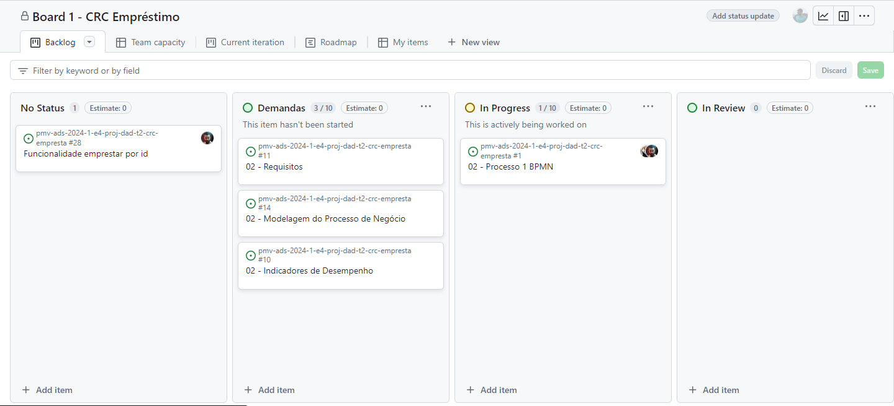

# Metodologia

Para o desenvolvimento deste trabalho, adotaremos a metodologia descrita a seguir, a qual abrangerá a relação de ambientes utilizados, a gestão do código fonte, definições dos processos, ferramentas e como a equipe se organizará e fará a gestão das tarefas ao longo do tempo disponível para a realização do projeto.

## Relação de Ambientes de Trabalho

Os artefatos do projeto são desenvolvidos a partir de diversas plataformas e a relação dos ambientes com seu respectivo propósito deverá ser apresentada em uma tabela que especifica que detalha Ambiente, Plataforma e Link de Acesso. 
Nota: Vide documento modelo do estudo de caso "Portal de Notícias" e defina também os ambientes e frameworks que serão utilizados no desenvolvimento de aplicações móveis.

## Controle de Versão

A ferramenta de controle de versão adotada no projeto foi o
[Git](https://git-scm.com/), sendo que o [Github](https://github.com)
foi utilizado para hospedagem do repositório.

O projeto segue a seguinte convenção para o nome de branches:

- `main`: versão estável já testada do software
- `unstable`: versão já testada do software, porém instável
- `testing`: versão em testes do software
- `dev`: versão de desenvolvimento do software

Quanto à gerência de issues, o projeto adota a seguinte convenção para
etiquetas:

- `documentation`: melhorias ou acréscimos à documentação
- `bug`: uma funcionalidade encontra-se com problemas
- `enhancement`: uma funcionalidade precisa ser melhorada
- `feature`: uma nova funcionalidade precisa ser introduzida

## Gerenciamento de Projeto

### Divisão de Papéis

Apresente a divisão de papéis entre os membros do grupo.

Exemplificação: A equipe utiliza metodologias ágeis, tendo escolhido o Scrum como base para definição do processo de desenvolvimento. A equipe está organizada da seguinte maneira:
- Scrum Master: jansem Torquetti Wallemberg Maia;
- Product Owner: Leonardo Moreira;
- Equipe de Desenvolvimento: Brendon Guimarães Antunes, Jansem Torquetti Wallemberg Maia, leonardo Moreira, Fabrício Maia dos Santos;
- Equipe de Design: Gabriel Palhares, Claudio, Fabrício Maia dos Santos.

### Processo

Será utilizado o metodo Scrum e a ferramenta utilizada será o Projects do Github, para acompanhamento das tarefas.

https://github.com/orgs/ICEI-PUC-Minas-PMV-ADS/projects/969

### Ferramentas

As ferramentas empregadas no projeto são:

VSCode - Editor de código.
WhatsApp - Ferramentas de comunicação
Figma - Ferramentas de desenho de tela

O editor de código foi escolhido porque ele possui uma integração com o sistema de versão. A ferramenta de comunicação utilizada possibilita a comunicação assincrona, possibilitando uma comuicação rápida e efetiva. Por fim, para criar wireframes utilizamos o figma, essa ferramenta por melhor captar as necessidades da nossa solução.

