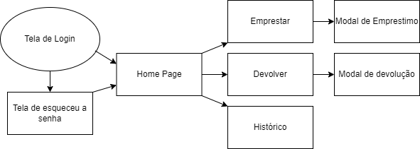
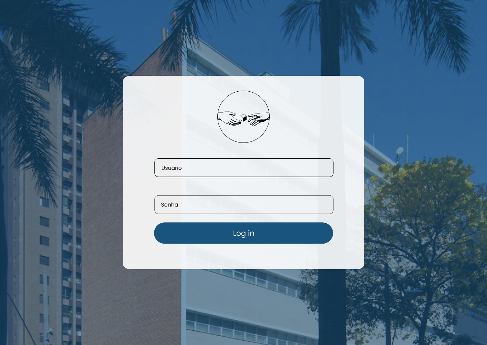
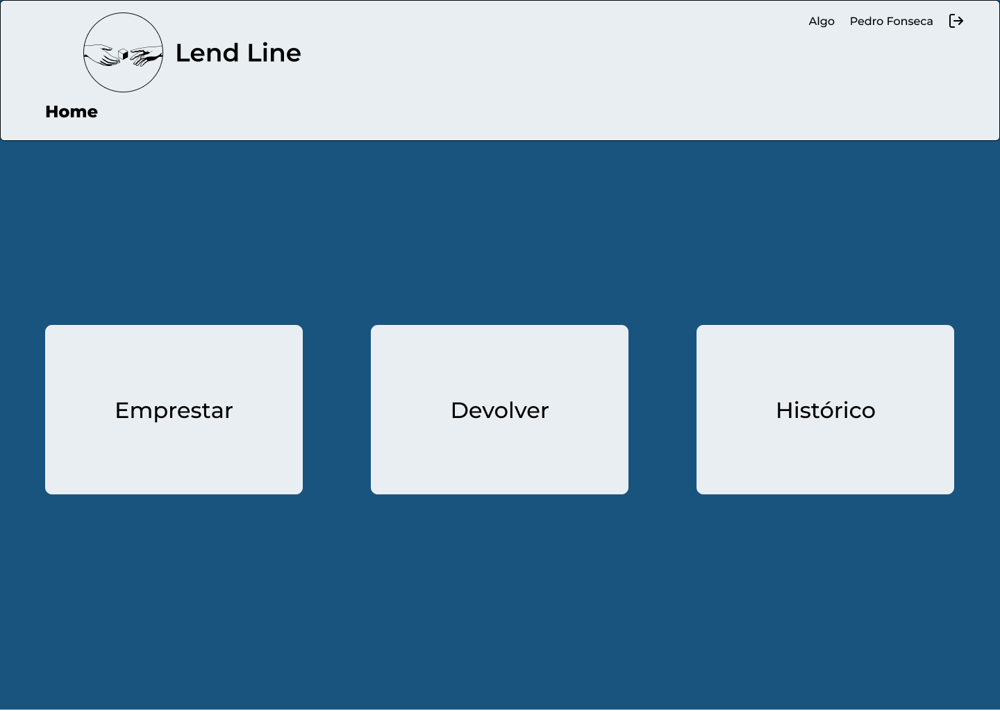
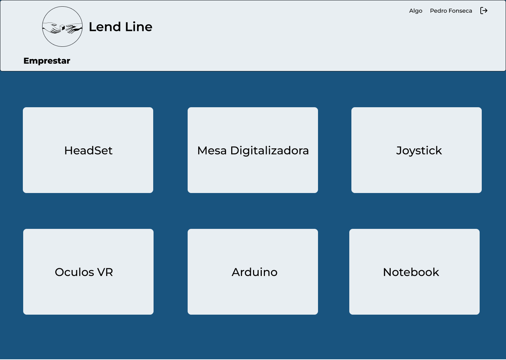
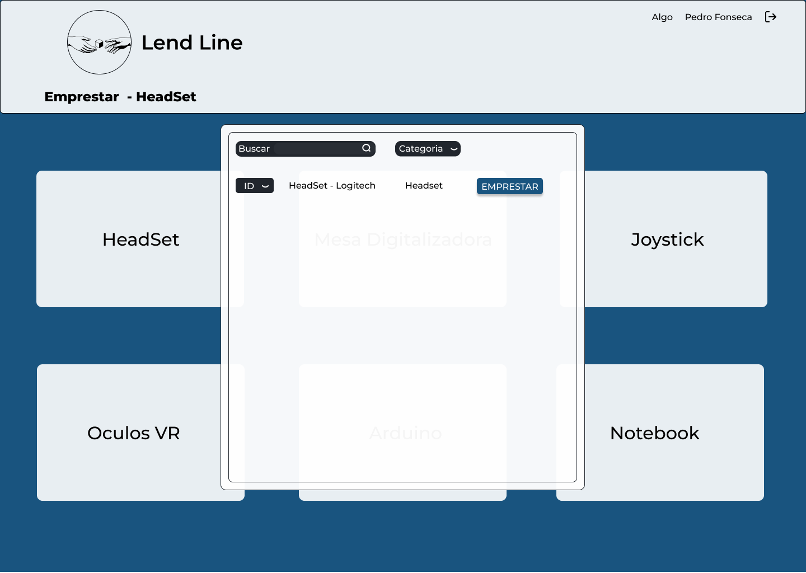
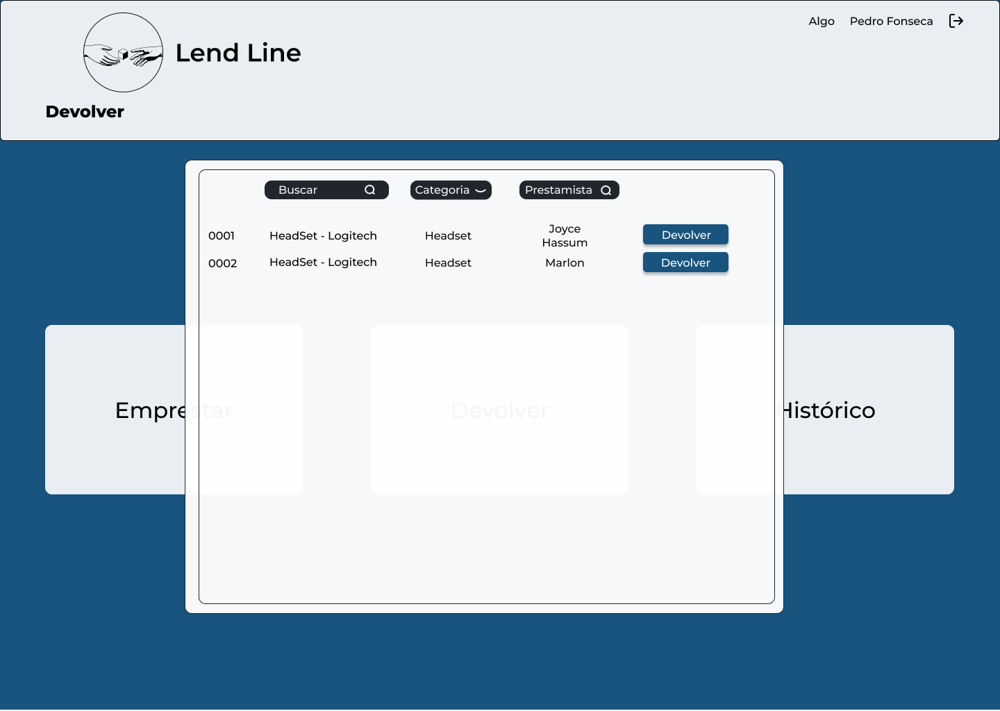
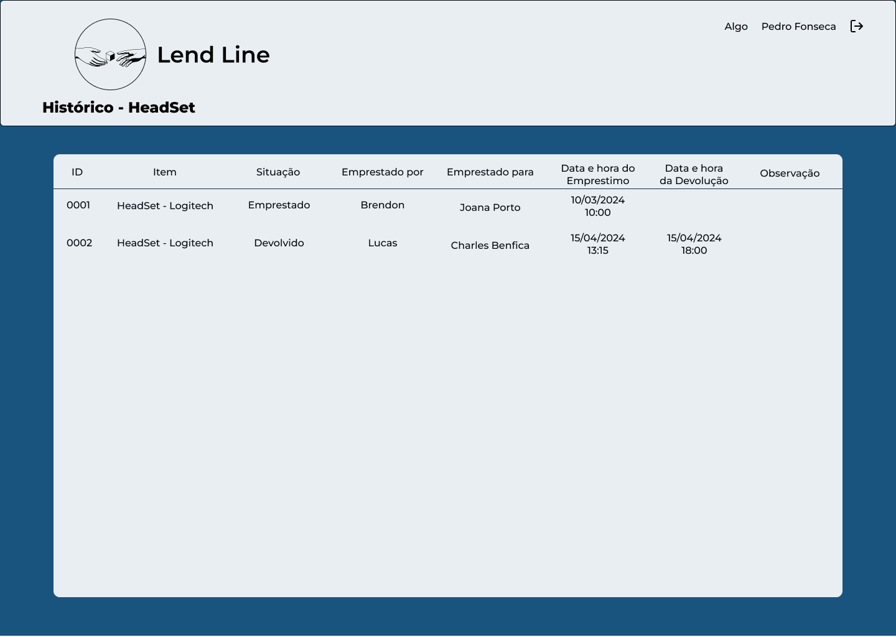

# Projeto de Interface

Para montagem da interface da aplicação estabelecemos como prioridade a acessibilidade, agilidade e usabilidade, mantendo um projeto visual mais sóbrio com foco no conteúdo. A aplicação manterá o seu padrão visual que atenderá a responsividade para desktops e smartphones.

## Diagrama de Fluxo

## Wireframes

### Tela de Login

### Tela Inicial - Home

### Tela de Empréstimo

### Tela de Empréstimo - "Modal do Item"

### Tela de devoulução - "Modal do Item"

### Tela de Histórico

