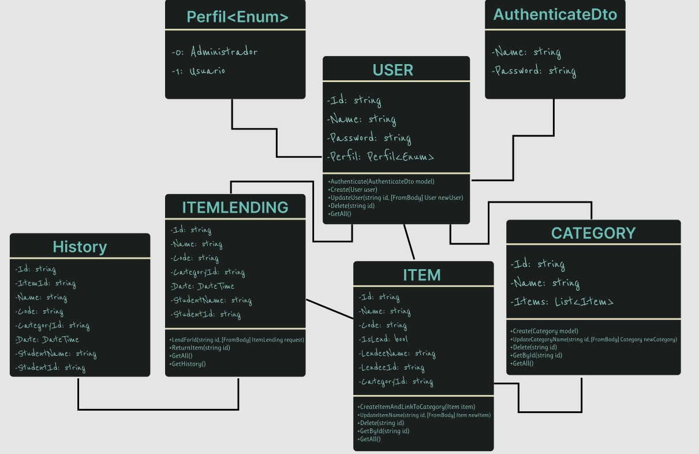

# Arquitetura da Solução

Definição de como o software é estruturado em termos dos componentes que fazem parte da solução e do ambiente de hospedagem da aplicação.

## Diagrama de Classes

## Modelo ER

O Modelo ER representa através de um diagrama como as entidades (coisas, objetos) se relacionam entre si na aplicação interativa.]

As referências abaixo irão auxiliá-lo na geração do artefato “Modelo ER”.

> - [Como fazer um diagrama entidade relacionamento | Lucidchart](https://www.lucidchart.com/pages/pt/como-fazer-um-diagrama-entidade-relacionamento)

## Esquema Relacional

O Esquema Relacional corresponde à representação dos dados em tabelas juntamente com as restrições de integridade e chave primária.
 
As referências abaixo irão auxiliá-lo na geração do artefato “Esquema Relacional”.

> - [Criando um modelo relacional - Documentação da IBM](https://www.ibm.com/docs/pt-br/cognos-analytics/10.2.2?topic=designer-creating-relational-model)

## Modelo Físico

Entregar um arquivo banco.sql contendo os scripts de criação das tabelas do banco de dados. Este arquivo deverá ser incluído dentro da pasta src\bd.

## Tecnologias Utilizadas

Para criar a web API, foi escolhida a linguagem CSharp na versão 6 devido às suas características e recursos específicos para desenvolvimento web. 

O framework Next.js foi utilizado para a construção do frontend web, aproveitando sua capacidade de renderização do lado do servidor (SSR) e sua estrutura de aplicação baseada em componentes, que facilita a criação de interfaces de usuário dinâmicas e responsivas.

Para o desenvolvimento da aplicação móvel, optou-se pelo uso do React Native, uma vez que permite o desenvolvimento de aplicativos nativos para iOS e Android com um único código base em JavaScript. Isso possibilita uma maior produtividade e facilidade de manutenção, pois as atualizações e correções são aplicadas de forma centralizada.

Entre as ferramentas utilizadas no desenvolvimento, destacam-se o Rider, que é uma IDE da JetBrains baseada em IntelliJ IDEA, conhecida por sua robustez e recursos avançados para desenvolvimento em CSharp. Além disso, foram utilizados o Visual Studio e o Visual Studio Code, ambos conhecidos pela sua eficiência e ampla gama de extensões que auxiliam no desenvolvimento em diversas linguagens e plataformas.

Para o desenvolvimento da aplicação móvel para Android, foi utilizado o Android Studio, que é a IDE oficial do Google para o desenvolvimento de aplicativos Android, oferecendo suporte completo ao desenvolvimento em React Native e outras tecnologias para a plataforma Android.

## Hospedagem

A Web API foi hospedada na Azure, aproveitando a infraestrutura e os serviços em nuvem da Microsoft para garantir escalabilidade e confiabilidade. Já a aplicação web e a aplicação móvel foram hospedadas na Vercel, uma plataforma de hospedagem especializada em aplicações front-end, que oferece integração fácil com frameworks como Next.js e React Native, garantindo um ambiente de hospedagem otimizado para aplicações web e móveis.

## Qualidade de Software

Conceituar qualidade de fato é uma tarefa complexa, mas ela pode ser vista como um método gerencial que através de procedimentos disseminados por toda a organização, busca garantir um produto final que satisfaça às expectativas dos stakeholders.

No contexto de desenvolvimento de software, qualidade pode ser entendida como um conjunto de características a serem satisfeitas, de modo que o produto de software atenda às necessidades de seus usuários. Entretanto, tal nível de satisfação nem sempre é alcançado de forma espontânea, devendo ser continuamente construído. Assim, a qualidade do produto depende fortemente do seu respectivo processo de desenvolvimento.

A norma internacional ISO/IEC 25010, que é uma atualização da ISO/IEC 9126, define oito características e 30 subcaracterísticas de qualidade para produtos de software.
Com base nessas características e nas respectivas sub-características, identifique as sub-características que sua equipe utilizará como base para nortear o desenvolvimento do projeto de software considerando-se alguns aspectos simples de qualidade. Justifique as subcaracterísticas escolhidas pelo time e elenque as métricas que permitirão a equipe avaliar os objetos de interesse.

> **Links Úteis**:
>
> - [ISO/IEC 25010:2011 - Systems and software engineering — Systems and software Quality Requirements and Evaluation (SQuaRE) — System and software quality models](https://www.iso.org/standard/35733.html/)
> - [Análise sobre a ISO 9126 – NBR 13596](https://www.tiespecialistas.com.br/analise-sobre-iso-9126-nbr-13596/)
> - [Qualidade de Software - Engenharia de Software 29](https://www.devmedia.com.br/qualidade-de-software-engenharia-de-software-29/18209/)
