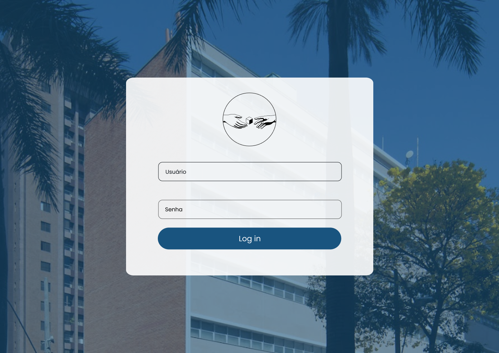
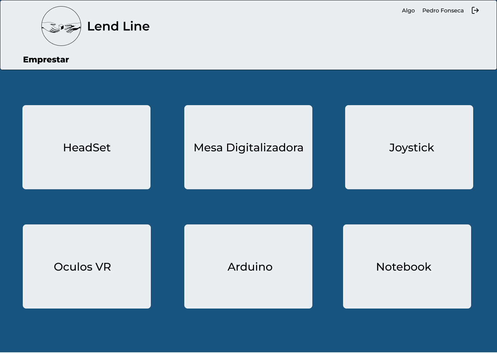

# Template Padrão da Aplicação

### Tela de Login

### Tela Inicial - Home

### Tela de Empréstimo

### Tela de Empréstimo - "Modal do Item"

### Tela de devoulução - "Modal do Item"

### Tela de Histórico

