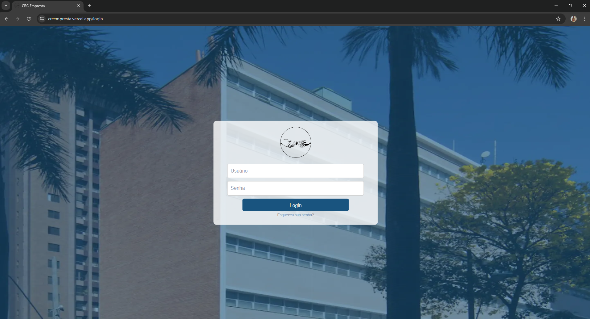
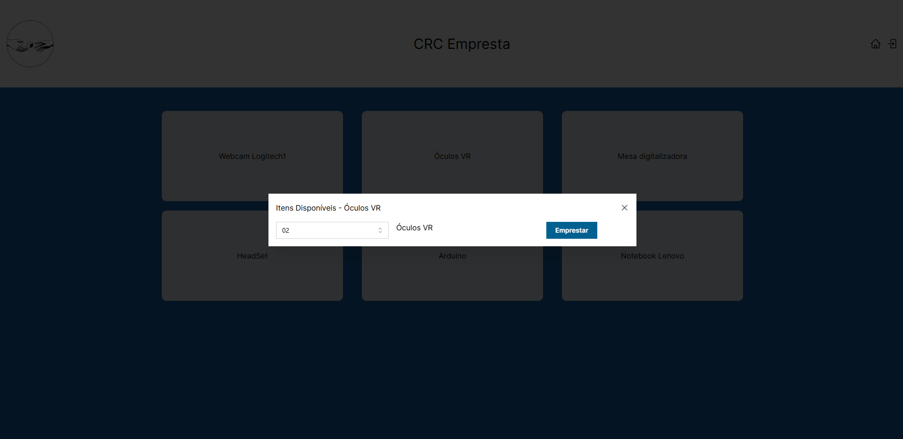
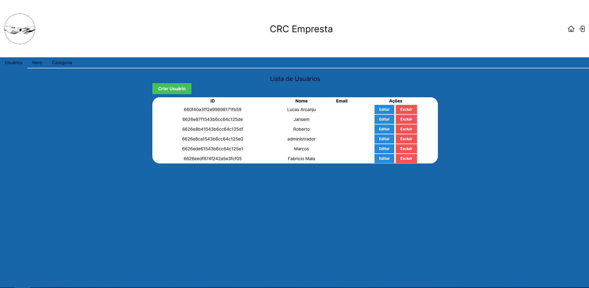
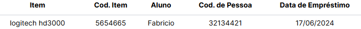
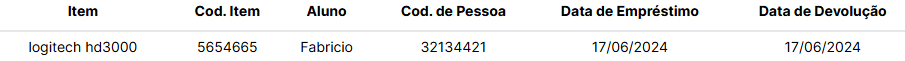
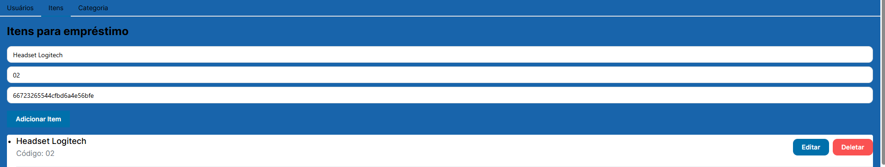
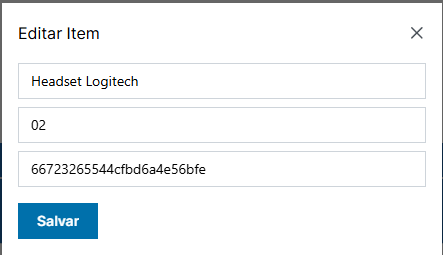
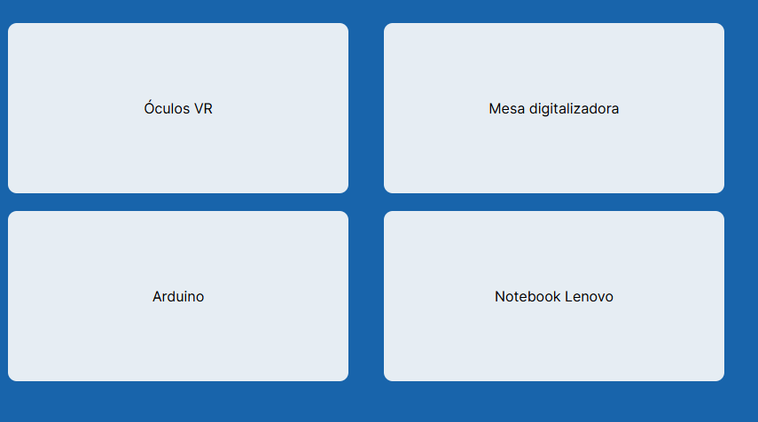

# Registro de Testes de Software

| **ID** | **Descrição do teste** | **Descrição do resultado** | **Gravidade** |
|:---: |:---: |:---: |:---: |
| CT-01 - RF-01 | A aplicação deve ser distribuída, permitindo o acesso em vários computadores conectados à rede. | | |
| Registro da tela:|  | Data do Teste: 23/06/24 - Resultado:  | SIm, a aplicação é distribuida podendo ser acessada por computadores conectados na rede. | 

#
| **ID** | **Descrição do teste** | **Descrição do resultado** | **Gravidade** |
|:---: |:---: |:---: |:---: |
| CT-02 - RF-02 | Validar a função de empréstimo e devolução de equipamentos. | |  |
| Registro da tela:|  | Data do Teste:  - Resultado:  | Sim, existe a função emprestar e a função devolver.|  
 

 # 
 | **ID** | **Descrição do teste** | **Descrição do resultado** | **Gravidade** |
|:---: |:---: |:---: |:---: |
| CT-03 - RF-03 | A aplicação deve ser acessada apenas com administrador | | |
| Registro da tela:|  | Data do Teste:  - Resultado:  | A tela do administrador serve para criação/edição de usuario, item e categoria. |  

# 
| **ID** | **Descrição do teste** | **Descrição do resultado** | **Gravidade** |
|:---: |:---: |:---: |:---: |
| CT-04 - RF-04 | O empréstimo deve ser validado com a identidade acadêmica do aluno ou professor. | | |
| Registro da tela:|  | Data do Teste:  - Resultado:  | Sim, o emprestimo fica vinculado ao nome e id do aluno ou professor. |  

# 
| **ID** | **Descrição do teste** | **Descrição do resultado** | **Gravidade** |
|:---: |:---: |:---: |:---: |
| CT-05 - RF-05 | A devolução deve ser validada com a identidade acadêmica do aluno ou professor. |    |    |
| Registro da tela:|  | Data do Teste:  - Resultado:  | Fica registrado a data de devolução conjunto com o nome e id do aluno/professor que fez o emprestimo.| 

# 
| **ID** | **Descrição do teste** | **Descrição do resultado** | **Gravidade** |
|:---: |:---: |:---: |:---: |
| CT-06 - RF-06 | Verificar se a aplicação permite criar novos itens. |    |    |
| Registro da tela:|  | Data do Teste:  - Resultado:  | Sim, é possivel criar o item e vincular ele a categoria. | 

# 
| **ID** | **Descrição do teste** | **Descrição do resultado** | **Gravidade** |
|:---: |:---: |:---: |:---: |
| CT-07 - RF-07 | Verificar se a aplicação permite editar itens. |    |    |
| Registro da tela:|  | Data do Teste:  - Resultado:  | É permitido editar o item. | 

# 
| **ID** | **Descrição do teste** | **Descrição do resultado** | **Gravidade** |
|:---: |:---: |:---: |:---: |
| CT-08 - RF-08 | Verificar se a aplicação permite excluir itens. |    |    |
| Registro da tela:|  | Data do Teste:  - Resultado:  | É permitido excluir o item. | 

# 
| **ID** | **Descrição do teste** | **Descrição do resultado** | **Gravidade** |
|:---: |:---: |:---: |:---: |
| CT-09 - RF-09 | Verificar se a aplicação mostra qual o codigo de pessoa do usuário tomador do empréstimo. |    |    |
| Registro da tela:|  | Data do Teste:  - Resultado:  | Sim, a aplicação aprensenta a informação. | 

# 
| **ID** | **Descrição do teste** | **Descrição do resultado** | **Gravidade** |
|:---: |:---: |:---: |:---: |
| CT-10 - RF-10 | Verificar se a aplicação mostra em qual local foi colocado o equipamento.|    |    |
| Registro da tela:|  | Data do Teste:  - Resultado:  | A aplicação aprensenta a categoria, aonde permite saber em qual local o item esta por categoria. | 

# 
